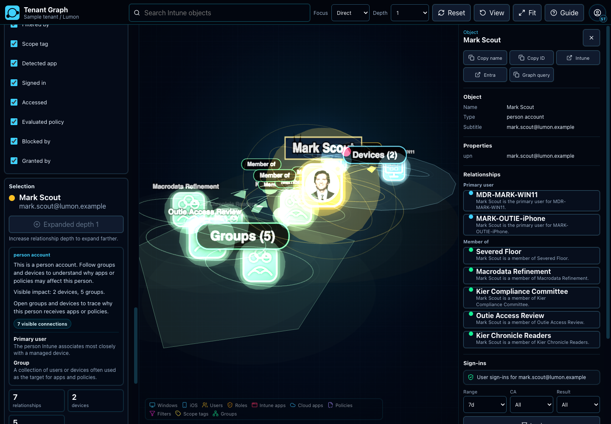
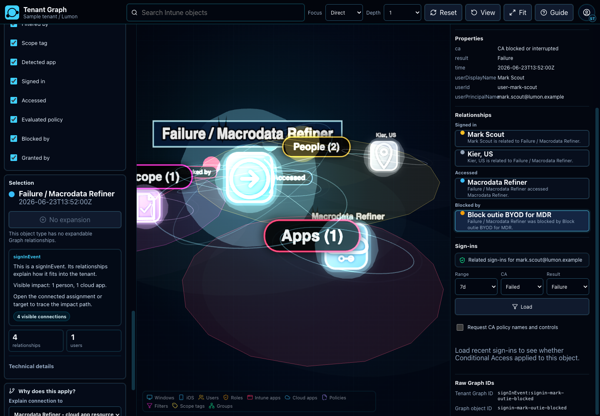

# Tenant Graph

Visualize Intune and Entra relationships as an interactive Three.js graph.


Tenant Graph helps tenant admins, endpoint engineers, and security reviewers understand Microsoft Intune impact. Sign in with Microsoft Entra ID, search for a user, device, app, group, role, or policy, then explore related assignments and dependencies in an Obsidian-style graph.

Live app: [tenantgraph.com](https://tenantgraph.com)

## Why It Exists

Intune and Entra relationships are hard to reason about in tables. Tenant Graph turns those relationships into a visual investigation workspace so teams can answer practical questions faster:

- Which users, groups, and devices are affected by this policy?
- Why did Conditional Access block or evaluate a sign-in?
- Which apps and assignments depend on this group?
- What changed recently around this object?
- Is a broad assignment, missing permission, or stale policy hiding risk?

## Try It

Open the hosted Lumon sample tenant:

[Launch Tenant Graph sample](https://tenantgraph.com/?sampleTenant=1)

No Microsoft Graph sign-in is required for the sample. For local setup, Entra app registration, permissions, and troubleshooting, see [Tenant Graph Setup](docs/setup.md).

## Sample Views

User, group, and device relationships:



Conditional Access blocked sign-in:



## Features

- Obsidian-style topology map for Intune and Entra objects.
- Microsoft Entra sign-in with MSAL and delegated Microsoft Graph scopes.
- Progressive graph expansion so large tenants stay usable.
- Object icons, user profile photos, app images, and type-aware colors.
- Readable Mode that explains relationships in plain language.
- Conditional Access sign-in view focused on blocked, applied, and evaluated policies.
- Admin impact panel for blast radius, hygiene signals, and copyable evidence.
- Capped default overviews with load-more controls for large environments.
- Sample tenant and guided tutorial for demos without tenant access.

## What It Models

- Users, devices, groups, directory roles, and scope tags
- Intune apps, app assignments, and detected apps
- Compliance policies, configuration profiles, settings catalog policies, and enrollment profiles
- Assignment filters and broad targets such as all users or all devices
- Sign-in events and Conditional Access policy outcomes

## Architecture

Tenant Graph keeps Microsoft Graph plumbing out of the UI:

```text
src/auth/              MSAL setup and token helpers
src/graph/             Microsoft Graph client, adapters, expansion, media hydration
src/models/            Tenant graph types
src/components/graph/  Three.js canvas, graph objects, overlays
src/components/layout/ Workspace shell, toolbar, sidebar
src/components/details/Readable details, evidence, path panels
src/utils/             Graph transforms and readable summaries
```

Graph adapters normalize Microsoft Graph responses before rendering:

```ts
type TenantNode = {
  id: string;
  type: string;
  label: string;
  subtitle?: string;
  raw?: unknown;
};

type TenantEdge = {
  id: string;
  source: string;
  target: string;
  type: string;
  label?: string;
};

type TenantGraph = {
  nodes: TenantNode[];
  edges: TenantEdge[];
};
```

## Contributing

```bash
npm run lint
npm run test
npm run build
```

Open a [bug report](https://github.com/jorgeasaurus/TenantGraph/issues/new?template=bug_report.yml) or [feature request](https://github.com/jorgeasaurus/TenantGraph/issues/new?template=feature_request.yml) to load the matching GitHub issue form. For code changes, open a [pull request](https://github.com/jorgeasaurus/TenantGraph/compare); GitHub applies the pull request template after you choose the branch to compare.

## License

MIT. See [LICENSE](LICENSE).
